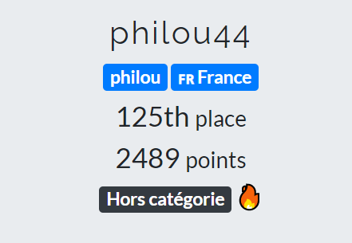
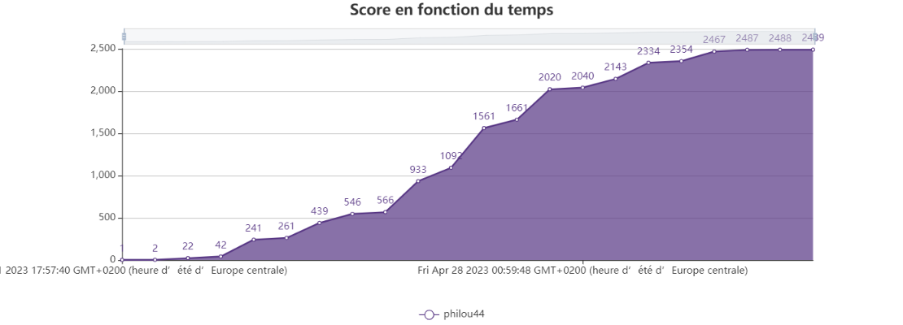

# FCSC-2023-writeup

Voici les réflexions menées pour résoudre certains des challenges proposés lors du [FCSC 2023](https://www.ssi.gouv.fr/agence/cybersecurite/france-cybersecurity-challenge-2023/). 
Le CTF s'est déroulé du 21 au 30 avril 2023 en ligne et a réuni 1364 compétiteurs.

## Résultat obtenu

 

## Challenges résolus

<table>
 <thead><tr><th>Catégorie</th><th>Challenge</th><th>Niveau</th><th>Points obtenus</th><th>Résolutions</th></tr></thead>
 <tbody>
  <tr><td rowspan=2>misc</td>
        <td><a href="./misc/Tri très sélectif/Tri très sélectif.md">Tri très sélectif</a></td><td>:star:</td><td>103</td><td>276</td></tr>
    <tr><td><a href="./misc/Zéro pointé/Zéro pointé.md">Zéro pointé</a></td><td>:star:</td><td>199</td><td>152</td></tr>
  <tr><td rowspan=3>Side Channel and Fault Attacks</td>
        <td><a href="./Side Channel and Fault Attacks/Un truc qui cloche/Un truc qui cloche.md">Un truc qui cloche</a></td><td>:star:</td><td>359</td><td>60</td></tr>
    <tr><td><a href="./Side Channel and Fault Attacks/RSA Secure Dev 1/RSA Secure Dev 1.md">RSA Secure Dev 1/3</a></td><td>:star:</td><td>367</td><td>56</td></tr>
    <tr><td><a href="./Side Channel and Fault Attacks/RSA Secure Dev 2/RSA Secure Dev 2.md">RSA Secure Dev 2/3</a></td><td>:star: :star:</td><td>469</td><td>13</td></tr>
  <tr><td rowspan=2>forensics</td>
        <td><a href="./forensics/Ransomémoire 0/Ransomémoire 0.md">Ransomémoire 0/3 - Pour commencer</a></td><td>:star:</td><td>100</td><td>475</td></tr>
    <tr><td><a href="./forensics/Weird Shell/Weird Shell.md">Weird Shell</a></td><td>:star:</td><td>113</td><td>248</td></tr>
  <tr><td rowspan=2>hardware</td>
        <td><a href="./hardware/canflag/canflag.md">canflag</a></td><td>:star:</td><td>159</td><td>186</td></tr>
    <tr><td><a href="./hardware/Fibonacci/Fibonacci.md">Fibonacci</a></td><td>:star:</td><td>178</td><td>169</td></tr>
  <tr><td rowspan=2>web</td>
        <td><a href="./web/ENISA Flag Store 1/ENISA Flag Store 1.md">ENISA Flag Store 1/2</a></td><td>:star:</td><td>107</td><td>263</td></tr>
    <tr><td><a href="./web/Salty Authentication/Salty Authentication.md">Salty Authentication</a></td><td>:star:</td><td>191</td><td>158</td></tr>
  <tr><td rowspan=7>intro</td>
        <td><a href="./intro/uid/uid.md">uid</a></td><td></td><td>20</td><td>305</td></tr>
    <tr><td><a href="./intro/La gazette de Windows/La gazette de Windows.md">La gazette de Windows</a></td><td></td><td>20</td><td>630</td></tr>
    <tr><td><a href="./intro/Tri sélectif/Tri sélectif.md">Tri sélectif</a></td><td></td><td>20</td><td>455</td></tr>
    <tr><td><a href="./intro/Comparaison/Comparaison.md">Comparaison</a></td><td></td><td>20</td><td>188</td></tr>
    <tr><td><a href="./intro/ROT13/ROT13.md">ROT13</a></td><td></td><td>20</td><td>990</td></tr>
    <tr><td><a href="./intro/T'es lent/T'es lent.md">T'es lent</a></td><td></td><td>20</td><td>741</td></tr>
    <tr><td><a href="./intro/Aaarg/Aaarg.md">Aaarg</a></td><td></td><td>20</td><td>460</td></tr>
  <tr><td rowspan=4>welcome</td>
        <td><a href="./welcome/Prechall FCSC 2023/Prechall FCSC 2023.md">Prechall FCSC 2023</a></td><td></td><td>1</td><td>144</td></tr>
    <tr><td><a href="./welcome/n3tc4t/n3tc4t.md">n3tc4t</a></td><td></td><td>1</td><td>954</td></tr>
    <tr><td><a href="./welcome/Discord/Discord.md">Discord</a></td><td></td><td>1</td><td>913</td></tr>
    <tr><td><a href="./welcome/Feedback/Feedback.md">Feedback</a></td><td></td><td>1</td><td>157</td></tr>
 </tbody>
</table>
