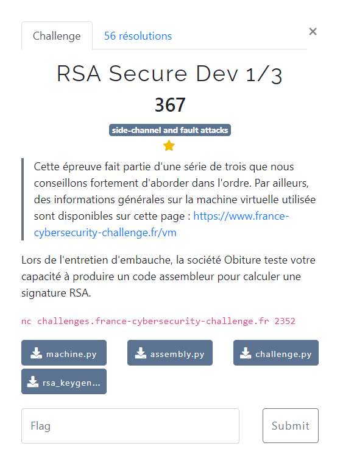

# RSA Secure Dev 1/3



Le descriptif de fonctionnement de la VM : [documentation](/description-vm/documentation.md)

Les fichiers fournis :
- [assembly.py](/description-vm/assembly.py)
- [machine.py](/description-vm/machine.py)
- [challenge.py](challenge.py)
- [rsa_keygeneration.py](rsa_keygeneration.py)


## 1ere approche

On implémente l'algorithme standard RSA utilisé pour calculer une signature `s` d'un message `m` :

$$ n = p \cdot q $$

$$ s = m^{d} \ (\bmod \ n) $$

Le code correspondant est le suivant : [`rsa1_1.asm`](rsa1_1.asm)

Pour assembler et obtenir le bytecode hexadécimal correspondant on utilise un petit script python : [assemble-rsa1-1.py](assemble-rsa1-1.py)

```bash
$ python3 assemble-rsa1-1.py
4ff1001D03501400
```

On soumet ce code sur le serveur :

```bash
$ nc challenges.france-cybersecurity-challenge.fr 2352
Enter your bytecode in hexadecimal:
>>> 4ff1001D03501400
Which flag do you want to grab?
  0. Quit.
  1. Easy flag   - check for code correctness and performances.
  2. Medium flag - check resistance against several fault attacks, d not given.
  3. Hard flag   - check resistance against more fault attacks, not e and not d given.
>>> 1
[+] Testing correctness...
[+] Correct!
[+] Testing performances against the reference solution...
[*] Reference performances: 8998921.30 ns
[*] User performance:       21990962.36 ns
[*] Ratio:                     2.44
[!] Error: too bad performances
Please check your inputs.
```

Bien que l'algorithme soit fonctionnellement juste, il n'est pas assez performant par rapport au code de référence (cf. `challenge.py`)

## 2ème approche

On utilise l'algorithme basé sur le [Théorême des restes chinois](https://en.wikipedia.org/wiki/RSA_(cryptosystem)#Using_the_Chinese_remainder_algorithm)

Autre article intéressant sur le sujet : https://www.cosade.org/cosade19/cosade14/presentations/session2_b.pdf

Le code est un peu plus compliqué : [`rsa1-2.asm`](rsa1-2.asm)

Point d'attention par rapport aux spécifications de la VM : certaines opérations acceptent uniquement des opérandes stockées sur les registres `R0` à `R7`. Cela concerne notamment la multiplication `MUL`.

On l'assemble via : [assemble-rsa1-2.py](assemble-rsa1-2.py)

```bash
$ python3 assemble-rsa1-2.py
00AC007D0352009C006D03514c89cb014b8900834e5902114fc94a501400
```

Et on le soumet sur le serveur :

```bash
$ nc challenges.france-cybersecurity-challenge.fr 2352
Enter your bytecode in hexadecimal:
>>> 00AC007D0352009C006D03514c89cb014b8900834e5902114fc94a501400
Which flag do you want to grab?
  0. Quit.
  1. Easy flag   - check for code correctness and performances.
  2. Medium flag - check resistance against several fault attacks, d not given.
  3. Hard flag   - check resistance against more fault attacks, not e and not d given.
>>> 1
[+] Testing correctness...
[+] Correct!
[+] Testing performances against the reference solution...
[*] Reference performances: 5064779.92 ns
[*] User performance:       4847448.06 ns
[*] Ratio:                     0.96
[+] Congrats! Here is the easy flag: FCSC{06de1084d295f2a016f79485f2a47744bfb9ed3e30e9312121665559df9447de}
```

Cette fois-ci l'algorithme, en plus d'être fonctionnellement juste, répond aux exigences de performance. On obtient alors le flag : `FCSC{06de1084d295f2a016f79485f2a47744bfb9ed3e30e9312121665559df9447de}`
