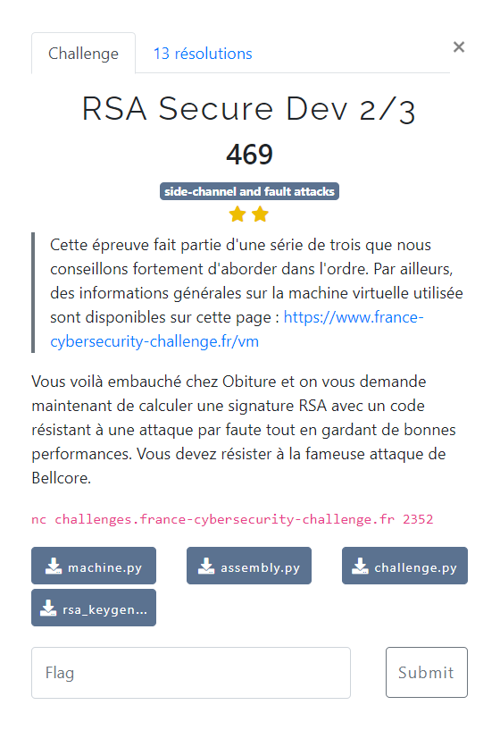

# RSA Secure Dev 2/3



Le descriptif de fonctionnement de la VM : [documentation](/description-vm/documentation.md)

Les fichiers fournis :
- [assembly.py](/description-vm/assembly.py)
- [machine.py](/description-vm/machine.py)
- [challenge.py](challenge.py)
- [rsa_keygeneration.py](rsa_keygeneration.py)

Quelques articles traitant des attaques par faute :
- https://fr.wikipedia.org/wiki/Attaque_par_faute
- https://eprint.iacr.org/2012/553.pdf

On reprend l'algorithme précédent : [`rsa1-2.asm`](../RSA%20Secure%20Dev%201/rsa1-2.asm)

Et on le complète en vérifiant que l'on sait retrouver le message de départ `m` à partir de la signature `s` obtenue :

$$ m = s^{e} \ (\bmod \ n) $$

Si tel est le cas, il n'y a pas eu d'attaque : on peut renvoyer la signature calculée.

Sinon, c'est qu'une attaque a été tentée : on renvoie une valeur aléatoire à la place.

L'algorithme utilisé est le suivant : [`rsa2.asm`](rsa2.asm)

On l'assemble grâce au script : [`assemble-rsa2.py`](assemble-rsa2.py) :

```bash
$ python3 assemble-rsa2.py
00AC007D0352009C006D03514c89cb014b8900834e5902114fc94a5000BC4ff2002D03010615c702050200201400
```

Puis on le soumet au serveur, permettant d'obtenir le flag :

```bash
$ nc challenges.france-cybersecurity-challenge.fr 2352
Enter your bytecode in hexadecimal:
>>> 00AC007D0352009C006D03514c89cb014b8900834e5902114fc94a5000BC4ff2002D03010615c702050200201400
Which flag do you want to grab?
  0. Quit.
  1. Easy flag   - check for code correctness and performances.
  2. Medium flag - check resistance against several fault attacks, d not given.
  3. Hard flag   - check resistance against more fault attacks, not e and not d given.
>>> 2
[*] Running attacks on your code when the machine is initialized without d.
[+] Congrats! Here is the medium flag: FCSC{3704721831edcd9f4cd231eb45a4880ea7af6962c358af355130d6881c155479}
```
