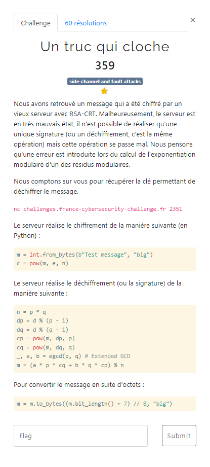

# Un truc qui cloche



L'algorithme de signature utilisé est celui de [RSA-CRT](https://en.wikipedia.org/wiki/RSA_(cryptosystem)#Using_the_Chinese_remainder_algorithm) (CRT = Chinese Remainder Theorem). Ce théorême est utilisé pour accélérer le calcul de signature, par rapport à l'algorithme classique.

D'ailleurs c'est celui à utiliser pour résoudre le Challenge [RSA Secure Dev 1/3](../RSA%20Secure%20Dev%201/RSA%20Secure%20Dev%201.md) :smile:

Si tout se passe bien, on devrait avoir pour tout message `m` et sa signature `s` :

$$ m = s^{e} \ (\bmod\ n) $$

Mais d'après l'énoncé, une erreur se produit dans le processus de signature au cours du calcul de `cp` ou `cq`.
On va donc avoir un delta entre les 2 valeurs, comme dans certaines attaques visant à induire une erreur dans le calcul (type Bellcore) :

$$ pour\ m' = s^{e}  \ (\bmod\ n),\ m \not \equiv m'  \ (\bmod\ n) $$

Dans ce cas, on peut retrouver les valeurs de `p` et `q` :

$$ p = PGCD(n,\ m - m') \ => \ q = n / p$$

Il suffit ensuite d'appliquer l'algorithme RSA classique pour déchiffrer un message.

Lorsqu'on se connecte au serveur, celui-ci nous fournit :
- `c` : un message chiffré, qui doit probablement être le flag
- `e` : l'exposant de chiffrement
- `n` : le module de chiffrement
- `s` : la signature calculée, en utilisant l'algorithme déficient, à partir du message en clair que l'on fourni `m`.

On est donc capable de vérifier si :

$$ m \equiv s^{e} \ (\bmod\ n) $$

Si ce n'est pas le cas, on applique les formules précédentes pour déterminer `p`, `q`, puis déchiffrer le message `c`.

Voici un exemple d'éléments fournis par le serveur :
```bash
$ nc challenges.france-cybersecurity-challenge.fr 2351
You should decrypt this:
c = 6577181741767518239331987421715408783947242045801243591859807536255045317618712908998983506354632923870590409080331448008883149511515847797669933004490788908295274913979042077386561266082376378676192543237068777062865329622521842067166731434524963967878955867682094219615831008063604443712690661039981717546142058795719832345160042059507227830901185434635878935298544442778797432859994893134300153406456416140265088836865863695725600718742637995825667398745677284468438208924537245510470173026707382281048793191165761631453441294540107839726866128534788957270616892848963726675597080089956310518155225474953110076837
Type the message you want to sign (greater or equal to 2):
>>> 6577181741767518239331987421715408783947242045801243591859807536255045317618712908998983506354632923870590409080331448008883149511515847797669933004490788908295274913979042077386561266082376378676192543237068777062865329622521842067166731434524963967878955867682094219615831008063604443712690661039981717546142058795719832345160042059507227830901185434635878935298544442778797432859994893134300153406456416140265088836865863695725600718742637995825667398745677284468438208924537245510470173026707382281048793191165761631453441294540107839726866128534788957270616892848963726675597080089956310518155225474953110076837

Signature complete, you can verify with the following parameters:
e = 65537
n = 18413165671055271486805504766479270023488763626198961444697828056659673599879539348569347875801623673023127425881670717432890928906451218437207262665252779498049456978605081361961953777344927570156027170962090400181464529154399302800513409841741922023894183227430913733386485155034355625148270750152304568188835058512410130052375525462520228995655872445833574601849935363619615847503544157219365559540781953244228273131500264562632618972519116616776574103199349249850530259045591284692435571550690383479853543956358865279677526430000062584302782419207193101552663626968805940276612577415910998501968081548774604980649
s = 11758461701083156949590142070931551235700204989257607645791269766197247476171519814575643580703521233684360650535304325574122954469942729292608285573420042114996122026756068382087067793068059410496426036947486649704938084284347196297382470332772294496312906724003807618158005595260975564376745514625853477139167972605993245505857709215943441355672831564213548169915381808658181282913953631541501486923687771668171882871169415862689064735769394842508095132982434128395129320486271957144978343710545424220266540500963428460372788582739247688158165305970236861389593256758749902924788807000589637462753292482482511371232
```

Le script utilisé pour retrouver le flag : [un_truc_qui_cloche.py](un_truc_qui_cloche.py)

```bash
$ python3 un_truc_qui_cloche.py
clear_text ='FCSC{1ec0d4b4c2de4329e2431fb65d229fb7ba2fbf93206e8c273ca22172bdb64d99}'
```
