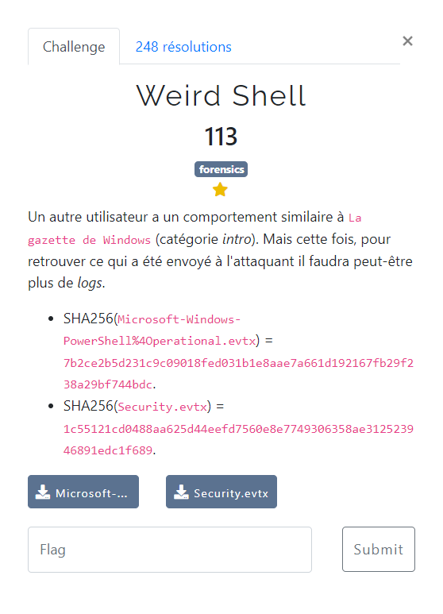

# Weird Shell



Les fichiers fournis :
- [Microsoft-Windows-PowerShell4Operational.evtx](Microsoft-Windows-PowerShell4Operational.evtx)
- [Security.evtx](Security.evtx)

On ouvre les 2 fichiers via l'Event Viewer windows.

Dans le journal des Applications, au niveau de l'événement 4104, on trouve la méthode générant le flag. Voici un extrait de cet événement limité à la partie pertinente :
```ps1
WriteToStream "FCSC{$(([System.BitConverter]::ToString(([System.Security.Cryptography.SHA256]::Create()).ComputeHash(([System.Text.Encoding]::UTF8.GetBytes(((Get-Process -Id $PID).Id.ToString()+[System.Security.Principal.WindowsIdentity]::GetCurrent().Name).ToString()))))).Replace('-', '').ToLower())}`n"
```

On voit qu'elle s'appuie sur :
- le PID qui a lancé le script
- l'identité de l'utilisateur qui a lancé le script

NB : l'identité renvoyée par `System.Security.Principal.WindowsIdentity` est au format `domaine\login`

Certaines de ces informations sont disponibles dans les détails de cet événément 4104 :
- System > Execution > [ ProcessID] : `3788`
- System > Security >  [ UserID] : `S-1-5-21-3727796838-1318123174-2233927406-1107`

On recherche l'utilisateur `S-1-5-21-3727796838-1318123174-2233927406-1107` dans le journal de Sécurité. On trouve sur le même horaire (événement 4688) une création de processus avec une ligne de commande qui correspond à l'exécution du script PS. Les caractéristiques de l'utilisateur sont les suivantes :
- SubjectUserName : `cmaltese`
- SubjectDomainName : `FCSC`

On crée un script similaire a celui utilisé, dans lequel on force les valeurs du PID et de l'identité de l'utilisateur avec celles obtenues :
```ps1
$p = 3788
$user = "FCSC\cmaltese"
$s = "FCSC{$(([System.BitConverter]::ToString(([System.Security.Cryptography.SHA256]::Create()).ComputeHash(([System.Text.Encoding]::UTF8.GetBytes(($p.ToString()+$user).ToString()))))).Replace('-', '').ToLower())}`n"
Write-Output "s= $s"
```

L'exécution du script permet de récupérer le flag :
```ps1
PS C:\FCSC_2023> ./payload.ps1
s= FCSC{21311ed8321926a27f6a6c407fdbe7dc308535caad861c004b382402b556bbfa}
```
