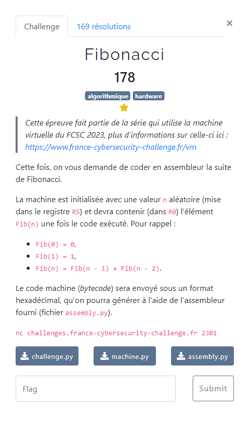

# Fibonacci

Le descriptif de fonctionnement de la VM : [documentation](/description-vm/documentation.md)

Les fichiers fournis :
- [assembly.py](/description-vm/assembly.py)
- [machine.py](/description-vm/machine.py)
- [challenge.py](challenge.py)
