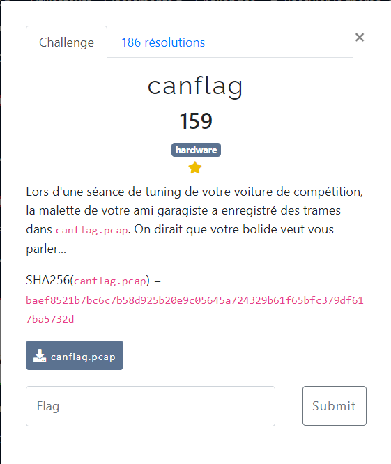
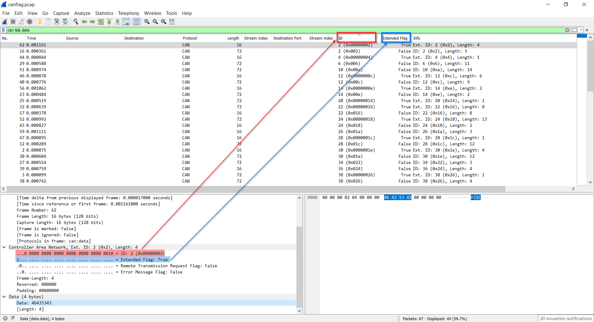

# canflag



Le fichier fourni : [canflag.pcap](canflag.pcap)

On ouvre le fichier `canflag.pcap` avec [Wireshark](https://www.wireshark.org/) :
- on applique le filtre `can && data` afin de ne retenir que les trames associées au protocole CAN pour lesquelles il y a des données
- on ajoute les colonnes correspondant à l'ID (`can.id`) et à l'Extended Flag (`can.flags.xtd`)
- on trie par ID et Extended Flag



Il suffit ensuite d'en extraire les données pour obtenir le flag `FCSC{aa9edf0a2ea5e233bdc3fc49535a09cc055a456df7db4ab8e5f6b47b9f603d6a1171d20b15458b7b44ac1ffbeb9ca92ac1d8aee3cd919184a27d6afd2dd4f01c50b0e57be6a1560a78e682556c529f74d8b04f8e660ce71f6e21013d1f2482f60ce1732e5983dbc14f37020b5a439e60c6797295c3cc58757bdeaa85a96eef37}`

On peut faire la même chose avec `tshark` :

```bash
$ tshark -2 -r canflag.pcap -T fields -e can.id -e can.flags.xtd -e data 'can.id && data' | sort -n -k1 -k2r | cut -f 3 | xxd -r -p

FCSC{aa9edf0a2ea5e233bdc3fc49535a09cc055a456df7db4ab8e5f6b47b9f603d6a1171d20b15458b7b44ac1ffbeb9ca92ac1d8aee3cd919184a27d6afd2dd4f01c50b0e57be6a1560a78e682556c529f74d8b04f8e660ce71f6e21013d1f2482f60ce1732e5983dbc14f37020b5a439e60c6797295c3cc58757bdeaa85a96eef37}
```
