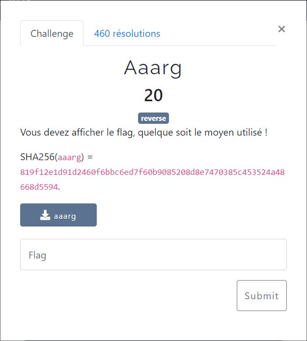

# Aaarg



Le fichier fourni : [aaarg](aaarg)

La recherche de chaines via `strings` ne donne rien.

On décompile le binaire avec [Ghidra](https://ghidra-sre.org/).

On retrouve la fonction principale qui est `FUN_00401190` :

```c
undefined8 FUN_00401190(int param_1,long param_2)
{
  undefined8 uVar1;
  ulong uVar2;
  char *local_10;

  uVar1 = 1;
  if (1 < param_1) {
    uVar2 = strtoul(*(char **)(param_2 + 8),&local_10,10);
    uVar1 = 1;
    if ((*local_10 == '\0') && (uVar1 = 2, uVar2 == (long)-param_1)) {
      uVar2 = 0;
      do {
        putc((int)(char)(&DAT_00402010)[uVar2],stdout);
        uVar2 += 4;
      } while (uVar2 < 0x116);
      putc(10,stdout);
      uVar1 = 0;
    }
  }
  return uVar1;
}
```

Plusieurs approches sont possibles pour résoudre le challenge. En voici quelques-unes.

## Approche bestiale

On voit que le flag est stocké dans `DAT_00402010`, qui est de taille `0x116` (soit 278 octets), en prenant 1 caractères sur 4.

Il suffit d'en extraire la valeur.

Pour cela plusieurs possibilités :
- utiliser Ghidra, pour aller à l'addresse de `DAT_00402010`
- utiliser `objdump`, en décompilant uniquement la plage sur laquelle `DAT_00402010` est stocké (i.e. `[0x00402010, 0x00402010+0x116]`) :
    > ```bash
    > $ objdump -s --start-address=0x402010 --stop-address=0x$[402010 + 116] aaarg
    >
    > aaarg:     file format elf64-x86-64
    >
    > Contents of section .rodata:
    >  402010 46e2808d 43e2808d 53e2808d 43e2808d  F...C...S...C...
    >  402020 7be2808d 66e2808d 39e2808d 61e2808d  {...f...9...a...
    >  402030 33e2808d 38e2808d 61e2808d 64e2808d  3...8...a...d...
    >  402040 61e2808d 63e2808d 65e2808d 39e2808d  a...c...e...9...
    >  402050 64e2808d 64e2808d 61e2808d 33e2808d  d...d...a...3...
    >  402060 61e2808d 39e2808d 61e2808d 65e2808d  a...9...a...e...
    >  402070 35e2808d 33e2808d 65e2808d 37e2808d  5...3...e...7...
    >  402080 61e2808d 65e2808d 63e2808d 31e2808d  a...e...c...1...
    >  402090 38e2808d 30e2808d 63e2808d 35e2808d  8...0...c...5...
    >  4020a0 61e2808d 37e2808d 33e2808d 64e2808d  a...7...3...d...
    >  4020b0 62e2808d 62e2808d 37e2808d 63e2808d  b...b...7...c...
    >  4020c0 33e2808d 36e2808d 34e2808d 66e2808d  3...6...4...f...
    >  4020d0 65e2808d 31e2808d 33e2808d 37e2808d  e...1...3...7...
    >  4020e0 66e2808d 63e2808d 36e2808d 37e2808d  f...c...6...7...
    >  4020f0 32e2808d 31e2808d 64e2808d 37e2808d  2...1...d...7...
    >  402100 39e2808d 39e2808d 37e2808d 63e2808d  9...9...7...c...
    >  402110 35e2808d 34e2808d 65e2808d 38e2808d  5...4...e...8...
    >  402120 64e2808d 7d00                        d...}.
    > ```
- utiliser `xxd`, en récupérant le contenu situé entre `[0x2010, 0x2010+0x116]` :
    > ```bash
    > $ xxd -seek $[0x2010] -len $[0x116] -p aaarg | tr -d '\n' | sed 's/\(..\)....../\1/g' | xxd -r -p
    > FCSC{f9a38adace9dda3a9ae53e7aec180c5a73dbb7c364fe137fc6721d7997c54e8d}
    > ```

## Approche bête

Utiliser `gdb` en mettant un point d'arrêt à l'adresse `0x00401190` qui correspond au début de la fonction principale `FUN_00401190`.

On peut alors exécuter le programme pas à pas jusqu'à l'adresse `0x004011d0` où la comparaison déterminant l'affichage ou non du flag est réalisée :

```asm
   0x4011c8    movslq %ebx, %rdx
   0x4011cb    mov    $0x2,%eax
  >0x4011d0    cmp    %rdx,%rcx
   0x4011d3    jne    0x401213
```

Il suffit alors de positionner des valeurs identiques dans les 2 registres `rdx` et `rcx` pour que la condition `uVar2 == (long)-param_1` soit vérifiée. Cela permet de rentrer dans la branche qui affiche le flag.


## Approche réfléchie

Pour rappel, la signature classique d'une fonction `main` utilisant les paramètres passés au programme est :

```c
int main(int argc, char* argv[])
```

On a donc les correspondances suivantes :
- `param1` correspond à `argc` = nombre de paramètres de la ligne de commande utilisée pour lancer le script
- `param2` correspond à `*argv[]` = la liste des paramètres.
A noter que le script lui-même est positionné en tant que 1er paramètre dans la liste (i.e à l'index 0).

La condition `uVar2 == (long)-param_1`, peut donc aussi s'écrire `uVar2 == -argc`

`uVar2` est déterminé en récupérant la partie `entière` de `*(char **)(param_2 + 8)`, via la fonction `strtoul`. Mais `*(char **)(param_2 + 8)`, n'est autre que `argv[1]`.

Donc la condition à remplir pour afficher le flag est : `argv[1] == -argc`.

Il suffit donc d'exécuter le programme avec `-2` comme uniquement argument :

```bash
$ ./aaarg -2
FCSC{f9a38adace9dda3a9ae53e7aec180c5a73dbb7c364fe137fc6721d7997c54e8d}
```
