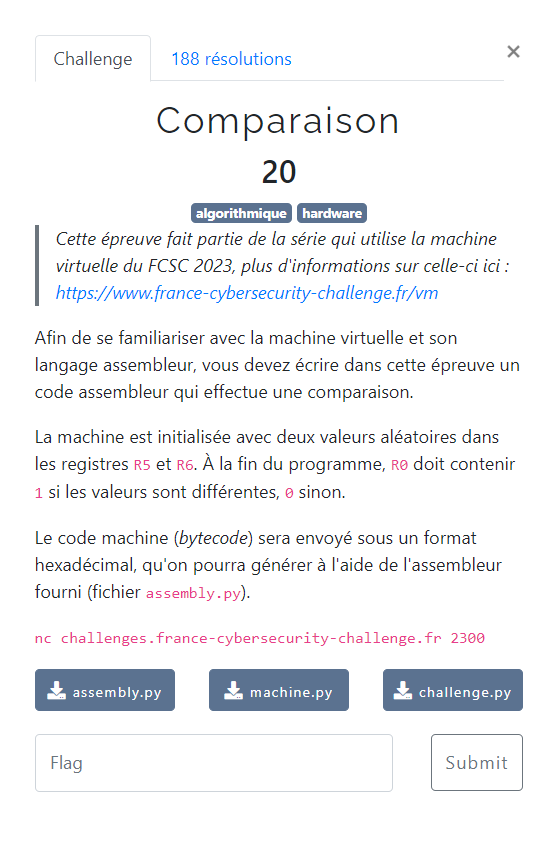

# Comparaison



Le descriptif de fonctionnement de la VM : [documentation](/description-vm/documentation.md)

Les fichiers fournis :
- [assembly.py](/description-vm/assembly.py)
- [machine.py](/description-vm/machine.py)
- [challenge.py](challenge.py)

La machine virtuelle fournit `CMP` comme instruction de comparaison, et valorise le flag `Z` en conséquence :
- si les 2 valeurs comparées sont égales, `Z = True`
- sinon `Z = False`

On peut ensuite conditionner la prochaine ligne d'instruction à exécuter en fonction de la valeur de `Z`, grâce aux instructions `JZR` et `JNZR`.

Pour finir l'instruction `MOV` permet de positionner dans un registre un nombre, exprimé en décimal ou en hexadécimal, si celui-ci est représenté sur au plus 16 bits. Ce qui est le cas pour `0` et `1`.

Et ne pas oublier l'instruction `STP` pour indiquer la fin de l'exécution du programme.

En combinant ces instructions, on aboutit par exemple à : [comparaison.asm](comparaison.asm)

L'étape suivante consiste à assembler le code, afin de récupérer le bytecode hexadécimal correspondant.
Pour cette opération on peut par exemple réaliser un petit script python : [assemble-comparaison.py](assemble-comparaison.py)
```bash
$ python3 assemble-comparaison.py
0665c703800000011400800000001400
```

Avant de soumettre sur le serveur, on peut vérifier en local le résultat du programme :
1. créer un fichier `flag.txt` (par exemple contenant : `the_flag`)
2. utiliser le script `challenge.py`

```bash
$ python3 challenge.py
Enter your bytecode in hexadecimal:
>>> 0665c703800000011400800000001400
[+] Congrats! Here is the flag: the_flag
```

On peut maintenant en toute confiance utiliser notre programme sur le serveur pour obtenir le vrai flag :

```bash
nc challenges.france-cybersecurity-challenge.fr 2300
Enter your bytecode in hexadecimal:
>>> 0665c703800000011400800000001400
[+] Congrats! Here is the flag: FCSC{6b7b0a69935108a38e58dfcb4efc857973efdc18b9db81ab9de047d3b9100b98}
```
