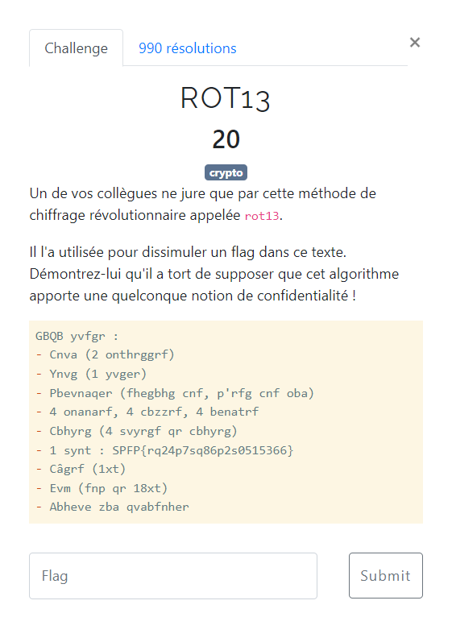

# ROT13



Le texte à déchiffrer est le suivant :
```txt
GBQB yvfgr :
- Cnva (2 onthrggrf)
- Ynvg (1 yvger)
- Pbevnaqer (fhegbhg cnf, p'rfg cnf oba)
- 4 onanarf, 4 cbzzrf, 4 benatrf
- Cbhyrg (4 svyrgf qr cbhyrg)
- 1 synt : SPFP{rq24p7sq86p2s0515366}
- Câgrf (1xt)
- Evm (fnp qr 18xt)
- Abheve zba qvabfnher
```

Si on y applique l'opération ROT13, par exemple via [CyberChef](https://gchq.github.io/CyberChef/#recipe=ROT13(true,true,false,13)&input=R0JRQiB5dmZnciA6DQotIENudmEgKDIgb250aHJnZ3JmKQ0KLSBZbnZnICgxIHl2Z2VyKQ0KLSBQYmV2bmFxZXIgKGZoZWdiaGcgY25mLCBwJ3JmZyBjbmYgb2JhKQ0KLSA0IG9uYW5hcmYsIDQgY2J6enJmLCA0IGJlbmF0cmYNCi0gQ2JoeXJnICg0IHN2eXJnZiBxciBjYmh5cmcpDQotIDEgc3ludCA6IFNQRlB7cnEyNHA3c3E4NnAyczA1MTUzNjZ9DQotIEPiZ3JmICgxeHQpDQotIEV2bSAoZm5wIHFyIDE4eHQpDQotIEFiaGV2ZSB6YmEgcXZhYmZuaGVy), on obtient alors le texte déchiffré :
```txt
- Pain (2 baguettes)
- Lait (1 litre)
- Coriandre (surtout pas, c'est pas bon)
- 4 bananes, 4 pommes, 4 oranges
- Poulet (4 filets de poulet)
- 1 flag : FCSC{ed24c7fd86c2f0515366}
- Pâtes (1kg)
- Riz (sac de 18kg)
- Nourir mon dinosaure
```

> :warning: ne pas appliquer de rotation sur les nombres.

Le flag est donc `FCSC{ed24c7fd86c2f0515366}`.
