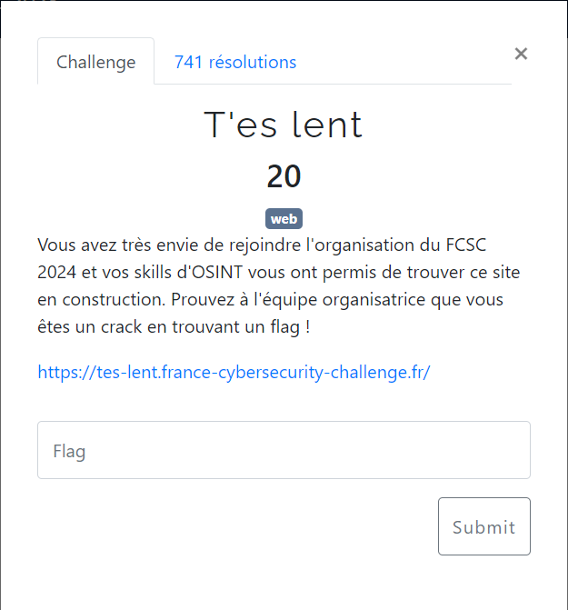
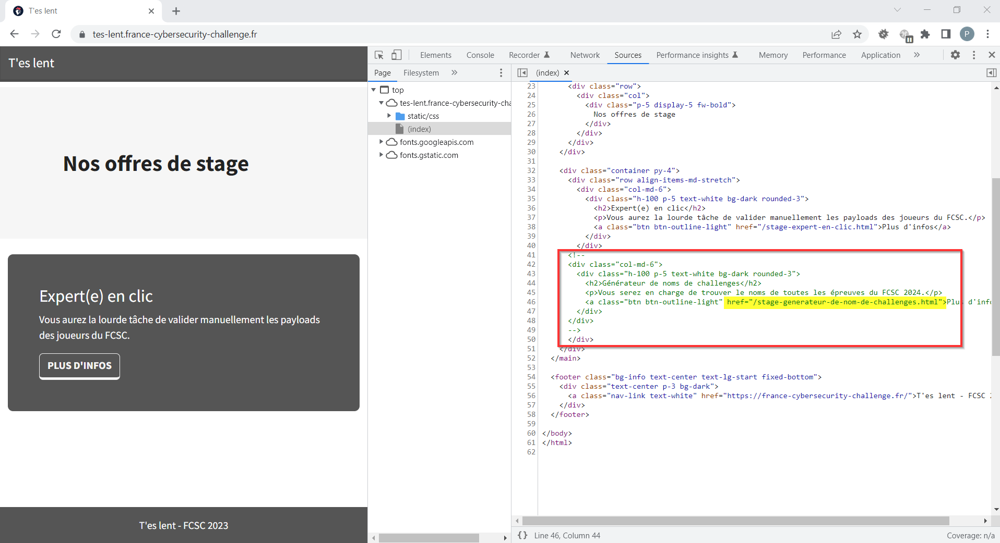
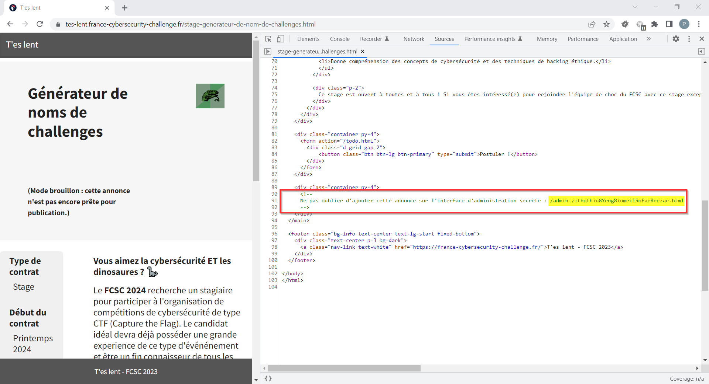
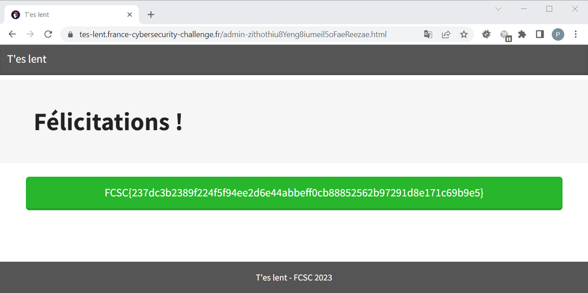

# T'es lent

En examinant le code HTML de l'URL indiquée, on découvre un bloc commenté contenant un lien vers une offre cachée : `/stage-generateur-de-nom-de-challenges.html`

Rebelotte, le code HTML de l'offre cachée, contient également un lien dans un bloc commenté : `/admin-zithothiu8Yeng8iumeil5oFaeReezae.html`

Le flag `FCSC{237dc3b2389f224f5f94ee2d6e44abbeff0cb88852562b97291d8e171c69b9e5}` est affiché sur cette dernière page :

