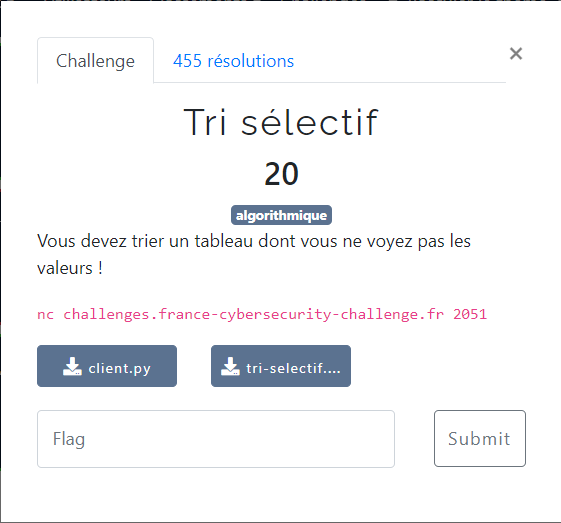

# Tri sélectif



Les fichiers fournis :
- [client.py](client.py)
- [tri-selectif.py](tri-selectif.py)

On utilise la solution mise au point pour le challenge [Tri très sélectif](../../misc/Tri%20tr%C3%A8s%20s%C3%A9lectif/Tri%20tr%C3%A8s%20s%C3%A9lectif.md)

```bash
$ python3 client-solution.py
[+] Opening connection to challenges.france-cybersecurity-challenge.fr on port 2051: Done
Le flag est : FCSC{e687c4749f175489512777c26c06f40801f66b8cf9da3d97bfaff4261f121459}
[*] Closed connection to challenges.france-cybersecurity-challenge.fr port 2051
```
