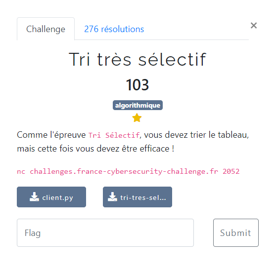

# Tri très sélectif



Les fichiers fournis :
- [client.py](client.py)
- [tri-tres-selectif.py](tri-tres-selectif.py)

On doit trier un tableau de 32 valeurs, en effectuant au maximum `5 * 32 + 25` comparaisons (comme spécifié dans `tri-tres-selectif.py`).

On pense à utiliser un algo de type [quicksort](https://fr.wikipedia.org/wiki/Tri_rapide). Sa complexité est en moyenne en `n.log(n)` : on devrait donc aboutir en respectant la contrainte du nombre maximum de comparaisons.

Voici l'implémentation réalisée : [tri-tres-selectif.py](tri-tres-selectif.py)
1. utilisation du dernier élément du tableau comme pivot
2. on compare les autres éléments du tableau avec ce pivot, et on note l'index de ceux qui sont plus grands (que le pivot)
3. on positionne le pivot à sa place dans le tableau
4. si un élément placé avant le pivot dans le tableau est plus grand que le pivot, on l'échange avec un élément plus petit placé après. Pour savoir si un élément est plus grand ou non, on s'appuie sur la liste des éléments plus grands constituée lors de l'étape 2.
5. on effectue de façon récursive les mêmes étapes pour le sous-tableau composé des éléments placés avant le pivot, et pour le sous-tableau composé des éléments placés après le pivot.

Et son exécution :

```bash
$ python3 client-solution.py
[+] Opening connection to challenges.france-cybersecurity-challenge.fr on port 2052: Done
Le flag est : FCSC{6d275607ccfba86daddaa2df6115af5f5623f1f8f2dbb62606e543fc3244e33a}
[*] Closed connection to challenges.france-cybersecurity-challenge.fr port 2052
```
