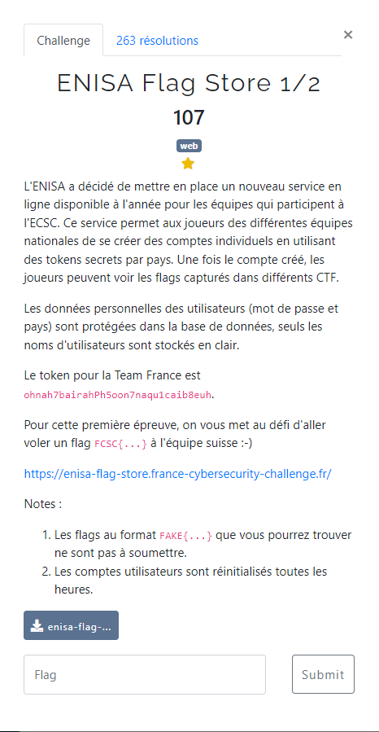
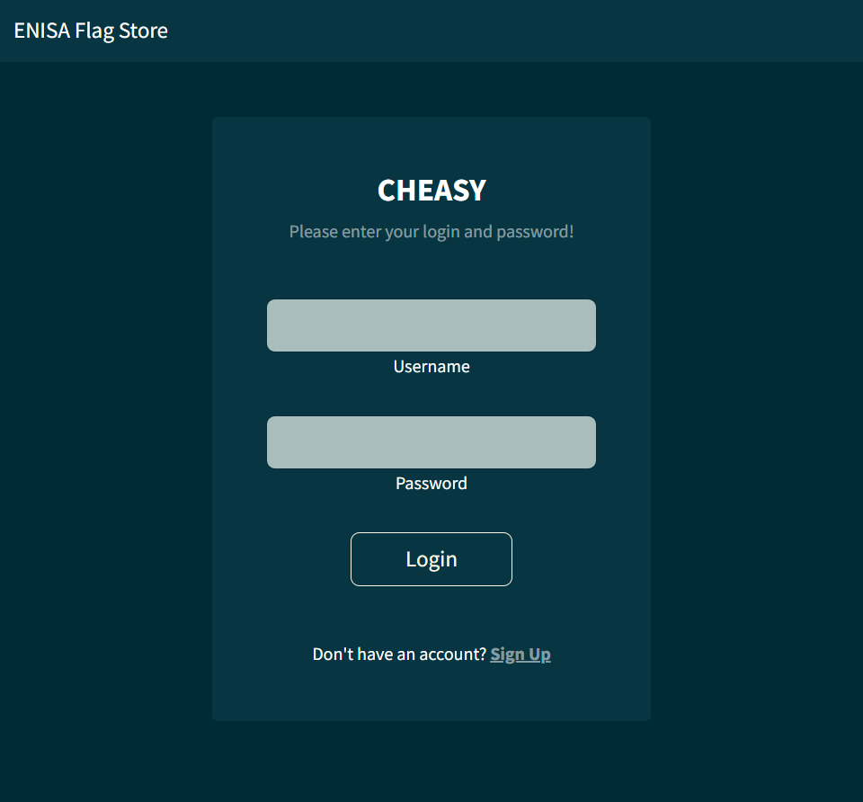
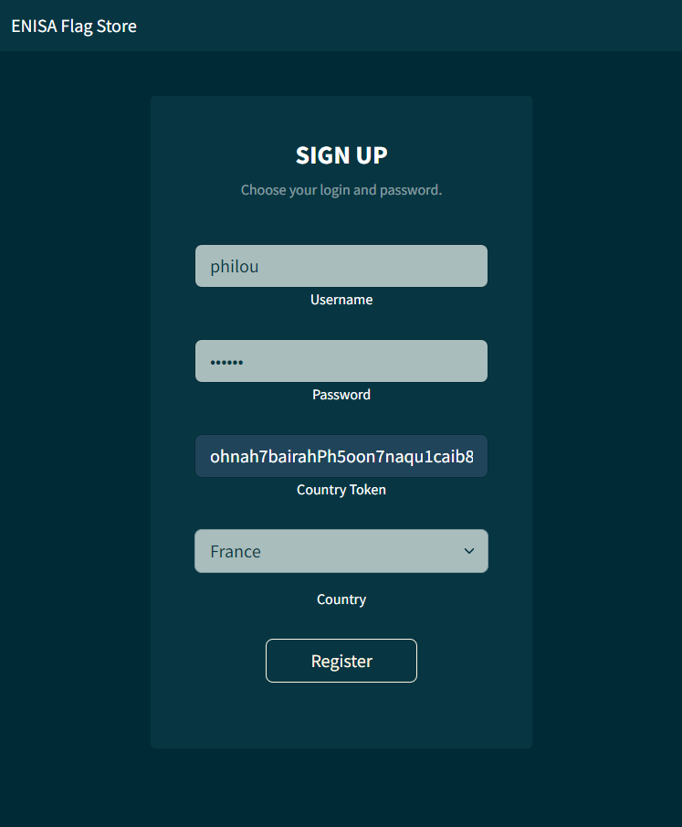
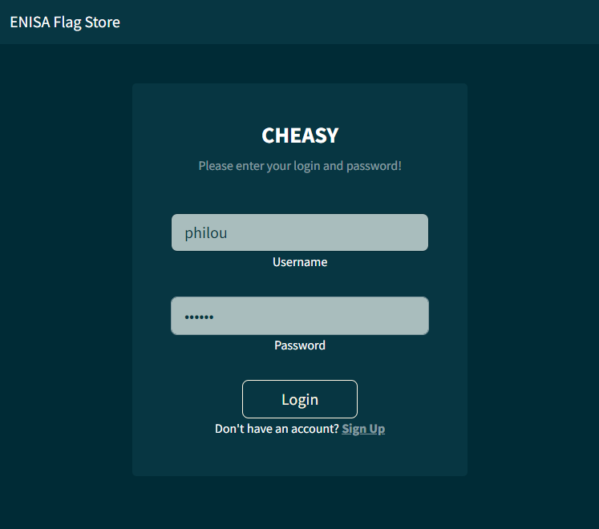
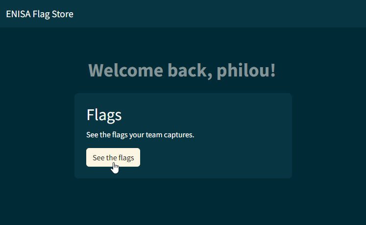
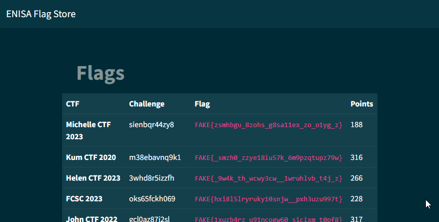
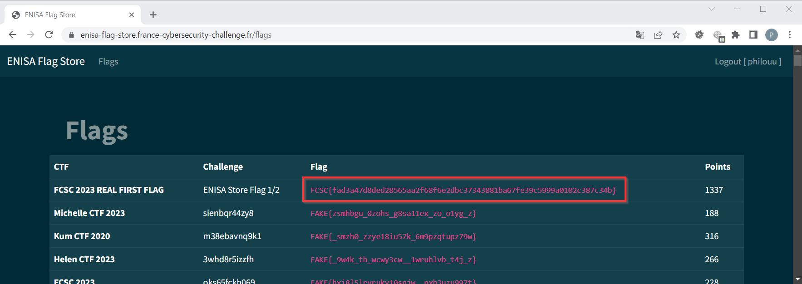

# ENISA Flag Store 1/2



Le fichier fourni : [enisa-flag-store.go](enisa-flag-store.go)

Une authentification est nécessaire pour accéder au site :



Le lien <u><code>Sign up</code></u> permet de créer un compte :



On peut ensuite s'en servir pour s'authentifier :



Une fois authentifié, la page d'accueil est la suivante :



Le bouton **`See the flags`** permet l'affichage des flags qui sont bien tous `FAKE{...}` :



On passe à l'analyse du code source fourni :
- une base de données PostgreSQL est utilisée pour stocker les données.
- en commentaire le DDL de 3 tables (`users`, `flags` et `country_tokens`) est fourni
- on cherche une possibilité d'exploitater une injection SQL

Toutes les requêtes à la base passent par un `prepare statement`, sauf une au niveau de la fonction `getData()` (qui est utilisée justement pour construire la page des flags) :

```go
func getData(user User) (
    []Flag,
    error,
) {
    var flags []Flag

    req := fmt.Sprintf(`SELECT ctf, challenge, flag, points
                        FROM flags WHERE country = '%s';`, user.Country);
    rows, err := db.Query(req);
    ...
}
```

Le `user.Country` est alimenté à partir de l'information fournie lors de la création du compte.

Lors de cette création de compte, la correspondance entre le `Country` et le `Country Token` est vérifiée dans la fonction `CheckToken()` :

```go
func CheckToken(country string, token string) (
    bool,
) {

    stmt, err := db.Prepare(`SELECT id FROM country_tokens
                             WHERE country = SUBSTR($1, 1, 2)
                             AND token = encode(digest($2, 'sha1'), 'hex')`)
    ...
}
```

... mais en prenant uniquement les 2 premiers caractères du `Country`.

On peut donc utiliser `Country` lors de la création du compte pour y positionner une directive SQL qui sera exploitée plus tard lors de l'affichage de la page des flags.

Les codes des différents pays sont disponibles dans le code HTML de la page de création de compte :
- `fr` pour la France
- `ch` pour la Suisse
- ...

En 1ere approche classique, on pense à injecter le fameux `OR 1=1`. Le code du pays à soumettre devient alors `fr' OR 1=1--` , au lieu de `fr`.

On peut aussi cibler un peu plus l'attaque (au cas où des flags leurres soient associés à d'autres pays que la Suisse), en affichant uniquement les flags suisses en plus des flags français avec `fr' OR country = 'ch`.

Avec un tel compte, le flag `FCSC{fad3a47d8ded28565aa2f68f6e2dbc37343881ba67fe39c5999a0102c387c34b}` cherché devient visible :


