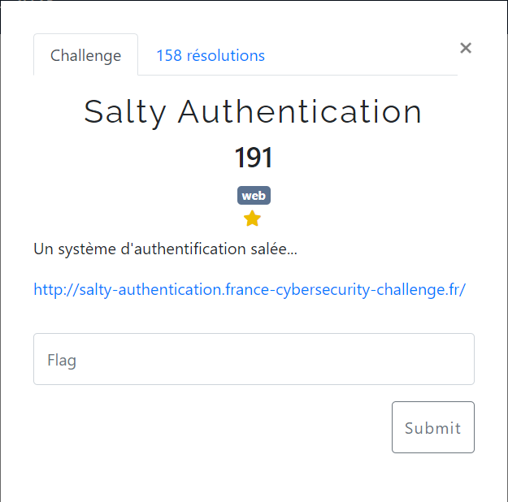

# Salty Authentication



L'URL affiche visiblement le code source de la page PHP servie :
```php
<?php

error_reporting(0);

include('flag.php');
$salt = bin2hex(random_bytes(12));

extract($_GET);

$secret = gethostname() . $salt;

if (isset($password) && strlen($password) === strlen($secret) && $password !== $secret) {
    if (hash('fnv164', $password) == hash('fnv164', $secret)) {
        exit(htmlentities($flag));
    } else {
        echo('Wrong password!');
        exit($log_attack());
    }
}

highlight_file(__FILE__);

?>
```
