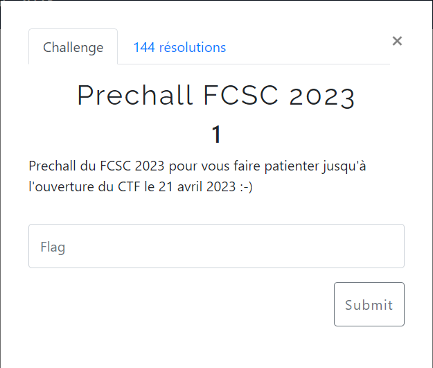
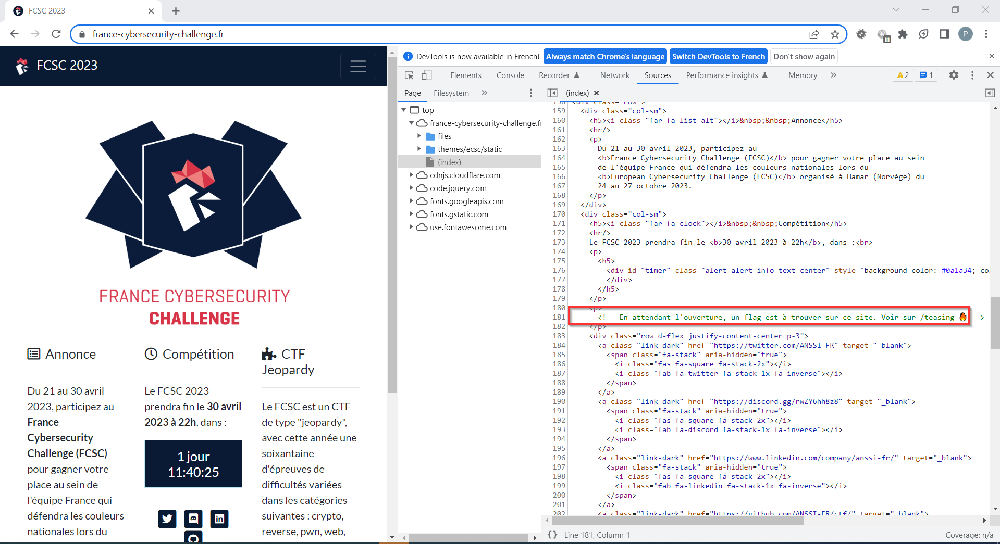
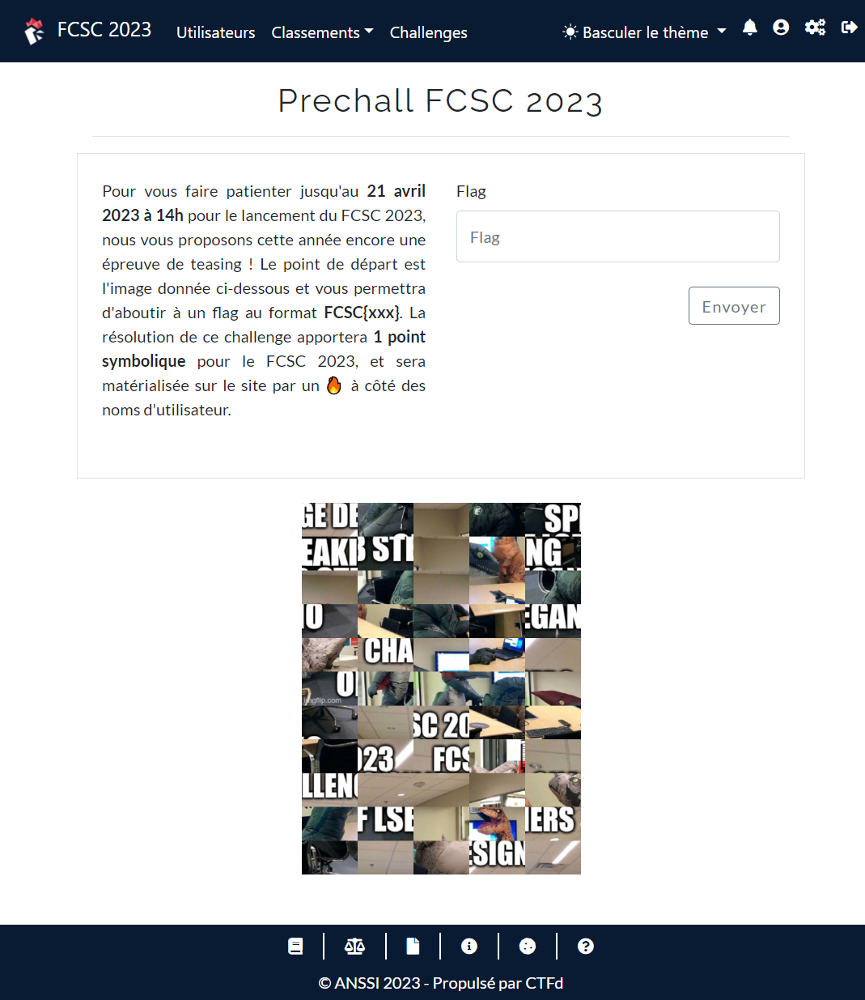
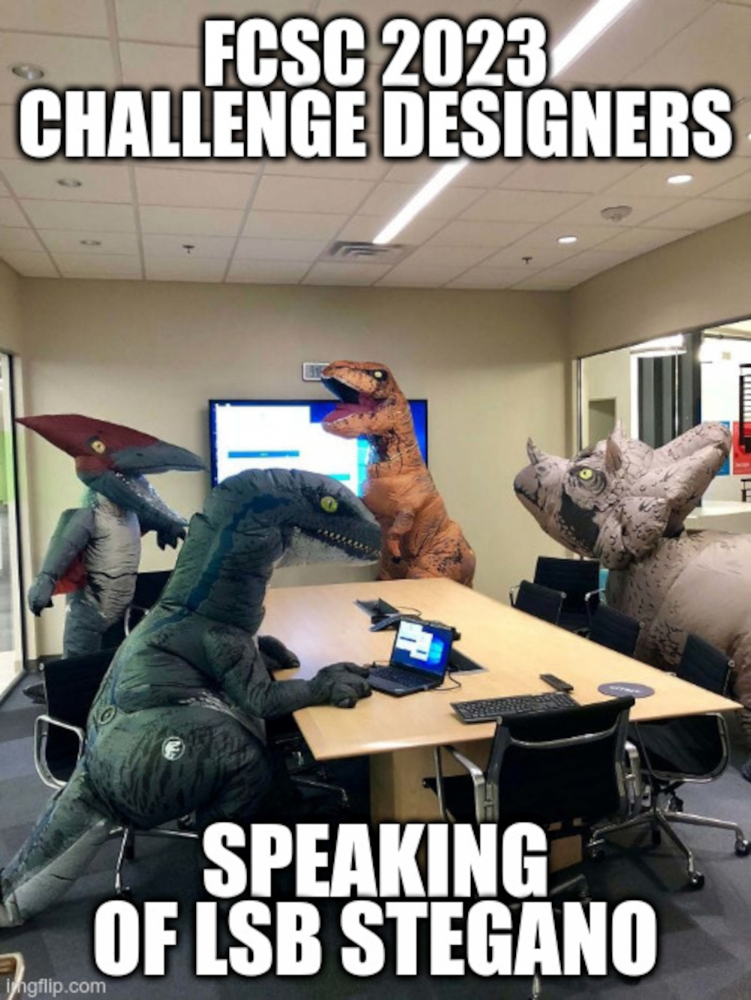
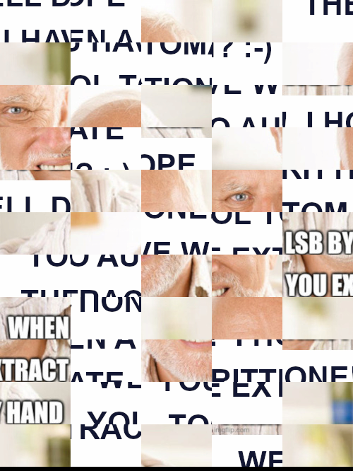

# Prechall FCSC 2023



Le code source de la page https://france-cybersecurity-challenge.fr/ contient un commentaire intéressant :



Celui-ci nous amène à la page du pré-challenge :



Elle contient une image [teaser.png](teaser.png) composée de différents "fragments" (5x11) mélangés.

On utilise le script [`teaser.py`](teaser.py) pour recomposer l'image.

On obtient l'image suivante :



On y recherche une information cachée via la technique LSB de Stéganographie, comme indiqué dans l'image.

On peut effectuer l'opération avec [stegsolve](http://www.caesum.com/handbook/Stegsolve.jar).

On y trouve bien des informations, qui une fois extraites, se révèlent être une nouvelle image PNG :

```bash
$ file teaser.lsb-extraction
teaser.lsb-extraction: PNG image data, 500 x 666, 8-bit/color RGB, non-interlaced
```



On utilise une variante du script précédent pour recomposer l'image [`teaser-step2.py`](teaser-step2.py) :


En recherchant à nouveau une information cachée, toujours par LSB, dans cette nouvelle image, on trouve un fichier exécutable 64 bits :

```bash
$ file teaser.bin
teaser.bin: ELF 64-bit LSB shared object, x86-64, version 1 (SYSV), dynamically linked, interpreter /lib64/ld-linux-x86-64.so.2, BuildID[sha1]=8633214f4900c48d504eb171c5013837f19a7d85, for GNU/Linux 3.2.0, stripped
```

On le décompile avec [Ghidra](https://ghidra-sre.org/). La fonction principale est `FUN_00101165` :

```c

undefined8 FUN_00101165(void)
{
  size_t sVar1;
  long lVar2;
  undefined8 *puVar3;
  char local_1128 [256];
  undefined8 local_1028 [4];
  undefined8 local_1008;
  undefined8 local_1000;
  undefined8 local_ff8;
  undefined8 local_ff0;
  int local_24;
  int local_20;
  int local_1c;
  int local_18;
  int local_14;
  int local_10;
  int local_c;
  
  puVar3 = local_1028;
  for (lVar2 = 0x200; lVar2 != 0; lVar2 += -1) {
    *puVar3 = 0;
    puVar3 = puVar3 + 1;
  }
  local_1028[0] = 0x20;
  local_1028[1] = 0;
  local_1028[2] = 0;
  local_1028[3] = 0;
  local_1008 = 0;
  local_1000 = 0;
  local_ff8 = 0;
  local_ff0 = 0;
  for (local_c = 0; local_c < 0x3f; local_c += 1) {
    for (local_10 = 0; local_10 < 0x40; local_10 += 1) {
      if ((*(ulong *)(&DAT_00104060 + (long)local_c * 8) >> ((byte)local_10 & 0x3f) & 1) == 0) {
        *(undefined *)((long)local_1028 + (long)local_10 + (long)local_c * 0x40) = 0x20;
      }
      else {
        *(undefined *)((long)local_1028 + (long)local_10 + (long)local_c * 0x40) = 0x23;
      }
    }
  }
  local_14 = 0;
  local_18 = 0;
  local_1c = 1;
  __isoc99_scanf("%188s",local_1128);
  sVar1 = strlen(local_1128);
  local_24 = (int)sVar1;
  for (local_20 = 0; local_20 < local_24; local_20 += 1) {
    if (local_1128[local_20] == 'L') {
      local_18 += -1;
    }
    else if (local_1128[local_20] == 'R') {
      local_18 += 1;
    }
    else if (local_1128[local_20] == 'U') {
      local_14 += -1;
    }
    else if (local_1128[local_20] == 'D') {
      local_14 += 1;
    }
    if (*(char *)((long)local_1028 + (long)local_18 + (long)local_14 * 0x40) == '#') {
      local_1c = 0;
    }
    if (local_14 < 0) {
      local_1c = 0;
    }
    if (local_18 < 0) {
      local_1c = 0;
    }
    if (0x3e < local_14) {
      local_1c = 0;
    }
    if (0x3e < local_18) {
      local_1c = 0;
    }
  }
  if (((local_1c == 1) && (local_14 == 0x3e)) && (local_18 == 0x3e)) {
    puts("Congrats!! You can use the flag given by this command to validate the challenge:");
    printf("echo -n %s | sha256sum | awk \'{ print \"FCSC{\" $1 \"}\" }\'\n",local_1128);
  }
  return 0;
}
```

On comprend que `local_1028` représente un labyrinthe. Les murs y sont représentés par `#` (dont le code hexadécimal est `0x23`). La définition des  murs est encodée via `DAT_00104060`.

On doit fournir une succession de mouvements (au plus 188), stockée dans `local_1128` pour trouver la sortie :
- le point de départ est en `(0x0, 0x0)`
- la sortie à atteindre est en `(0x3e, 0x3e)`
- les mouvements possibles sont `L` (gauche), `R` (droite), `U` (haut), `D` (bas)
- on doit toujours rester sur le chemin (i.e. ne pas être sur un mur `#`)
- on doit rester dans le cadre du labyrinthe `[0x0:0x3e, 0x0:0x3e]`

Pour connaître le chemin à suivre, on reconstitue le labyrinthe avec le script [`teaser-step3.py`](teaser-step3.py), avec l'adaptation suivante :
- `.` pour les chemins (au lieu d'espace)
- `█` pour les murs (au lieu de `#`)

Voici le labyrinthe ainsi reconstitué : [`teaser-maze.txt`](teaser-maze.txt).

NB : on peut résoudre le labyrinthe à la main, car il n'y a qu'un seul chemin possible, même si cela prend un temps certain :smile:.

Le parcours en `x` rouge permettant depuis l'entrée `E` d'aboutir à la sortie `S` : [teaser-parcours.pdf](teaser-parcours.pdf)

On utilise la suite de mouvements correspondant :

```bash
$ cat <(perl -e 'print "R" x 1 . "D" x 9 . "R" x 2 . "D" x 6 . "R" x 2 . "D" x 2 . "R" x 4 . "D" x 2 . "R" x 8 . "D" x 2 . "L" x 2 . "D" x 2 . "R" x 2 . "D" x 6 . "L" x 2 . "D" x 4 . "R" x 6 . "U" x 2 . "R" x 8 . "U" x 4 . "R" x 2 . "D" x 2 . "R" x 12 . "D" x 6 . "R" x 2 . "U" x 4 . "R" x 2 . "D" x 2 . "R" x 2 . "U" x 4 . "R" x 4 . "U" x 2 . "R" x 2 . "D" x 2 . "R" x 2 . "D" x 2 . "R" x 4 . "D" x 4 . "L" x 2 . "D" x 10 . "R" x 2 . "D" x 2 . "L" x 4 . "D" x 4 . "L" x 4 . "D" x 2 . "R" x 4 . "D" x 2 . "R" x 4 . "D" x 2 . "L" x 2 . "D" x 4 . "R" x 3 . "D" x 1 ') | ./teaser.bin

Congrats!! You can use the flag given by this command to validate the challenge:
echo -n RDDDDDDDDDRRDDDDDDRRDDRRRRDDRRRRRRRRDDLLDDRRDDDDDDLLDDDDRRRRRRUURRRRRRRRUUUURRDDRRRRRRRRRRRRDDDDDDRRUUUURRDDRRUUUURRRRUURRDDRRDDRRRRDDDDLLDDDDDDDDDDRRDDLLLLDDDDLLLLDDRRRRDDRRRRDDLLDDDDRRRD | sha256sum | awk '{ print "FCSC{" $1 "}" }'
```

Pour obtenir le flag, on applique la commande fournie :

```bash
$ echo -n RDDDDDDDDDRRDDDDDDRRDDRRRRDDRRRRRRRRDDLLDDRRDDDDDDLLDDDDRRRRRRUURRRRRRRRUUUURRDDRRRRRRRRRRRRDDDDDDRRUUUURRDDRRUUUURRRRUURRDDRRDDRRRRDDDDLLDDDDDDDDDDRRDDLLLLDDDDLLLLDDRRRRDDRRRRDDLLDDDDRRRD | sha256sum | awk '{ print "FCSC{" $1 "}" }'
FCSC{5cf9940286533f76743984b95c8edede9dbfde6226de012b8fe84e15f2d35e83}
```
