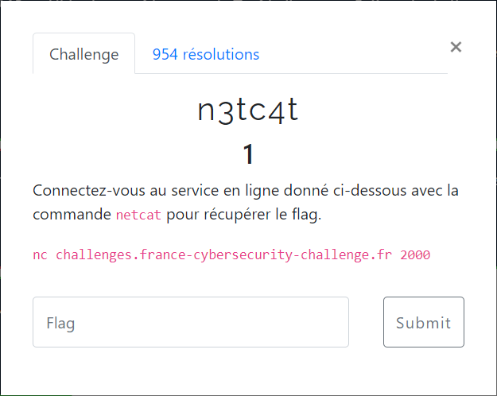

# n3tc4t



En suivant les indications, on obtient directement le flag :
```bash
$ nc challenges.france-cybersecurity-challenge.fr 2000

FCSC{Tous_les_flags_ressemblent_à_ce_genre_de_chaines_de_caractères!}
```
